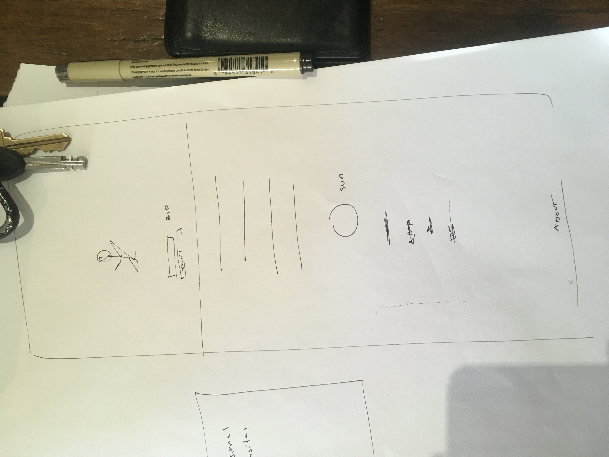

# First Client!

@deanoemcke and I jumped on a call to talk about his project for his kid's art. Basically, Sun Oemcke makes some pretty great art, and Dean wants to sell the art to help pay for Sun's education. Dean himself is a programmer, but needs some help getting off of his butt and building this website. By paying me to design the site and get it up and off the ground, he's able to bootstrap it forward. I also am going to plan the marketing strategy for it for the year going forward, which sounds fun, too.

We had a 15 minute video hangout to discuss the project. At the end, we've decided on 4 hours at $250USD total. I'll probably throw in another hour of work at the end, too, but that should be enogh to build the whole site I've already prototyped on paper

He also threw in $5 for helping him install [the stale Probot](https://probot.github.io/apps/stale/) on [thegreatsuspender](https://github.com/deanoemcke/thegreatsuspender), his extension for dealing with tabs. Open Source for the win!

I'm very excited about this. It's a ton of fun, and I think I'll enjoy working on this project - mostly because it's art, it helps Sun go to college, and I like working with Dean. So, scheduling time away for that.

What's next?
